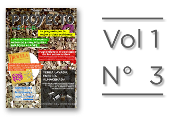
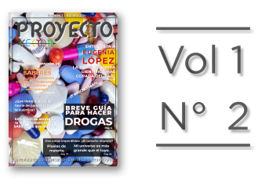
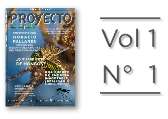
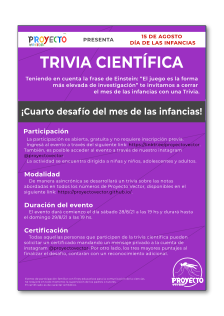
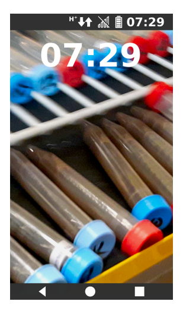
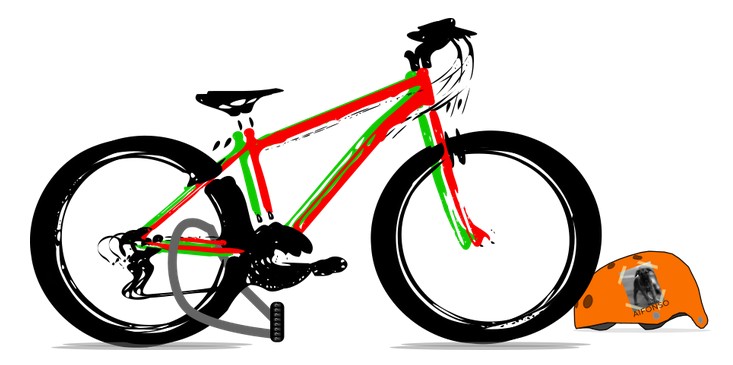
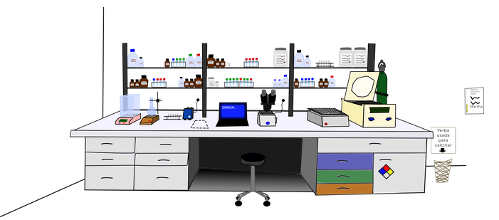
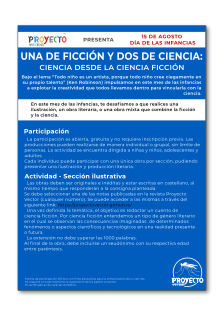
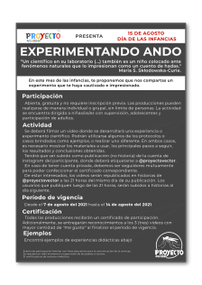
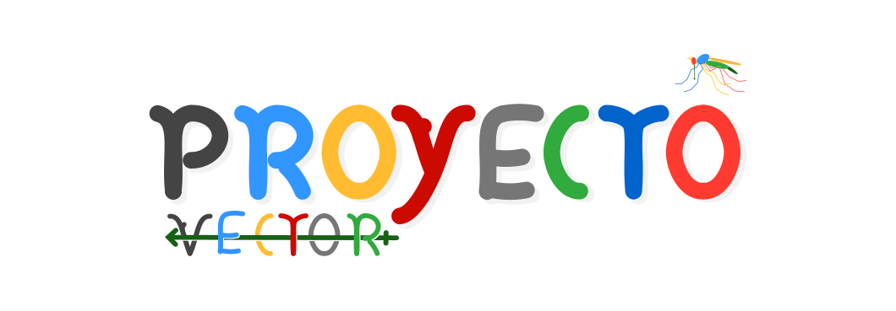

### Contenidos
[Revista Vector](#revista-vector)  ||  [Podcasts](#podcasts)  ||  [Nosotros](#nosotros) ||  [Salas de Escape](#evento-ciencia-e-infancias) 

---

# Revista PROYECTO VECTOR

## La revista de divulgación científica y tecnológica Argentina.

Volumen 1

Números:

###### 
#### (Para leer y descargar tocá la portada o entrá por [acá](http://bit.ly/3uwhgiE-PV_N3V1).)

###### 
#### (Para leer y descargar tocá la portada o entrá por [acá](https://drive.google.com/file/d/178XMdk2d7tHr6CqSkPTQG8mjRPsw1T8O/view?usp=sharing).)

###### 
#### (Para leer y descargar tocá la portada o entrá por [acá](https://bit.ly/3mCT37n-ProyectoVectorN1V1).)

¡Al fin salió!

##### Volver al inicio: [Contenidos](#contenidos)
---

# EVENTO CIENCIA e INFANCIAS

## ¡Lanzamos la Trivia Científica! (Del sábado 28/8 a las 19 hs hasta el domingo 29/8 a las 19 hs.)

#### No te podés pordér esta trivia científica. Para ganar podés valerte de la información incluida en las revistas gratuitas de PV: ¡DESCARGALAS!.

#### Entreate como participar y obtener tu certificado:

###### 
#### (Para leer y descargar tocá la imagen o entrá por [acá](https://bit.ly/Trivia_PV).)

#### ¡Diviértanse!

## Lanzamos la SALA DE ESCAPE

#### Esta es una sala de escape colaborativa, que requiere que dos participantes jueguen en simultáneo en las dos salas: A y B. Para escapar de las salas pueden valerse de la información incluida en las revistas de Proyecto Vector, que pueden descargar desde esta misma página. 

#### Para entrar a las salas tocá o hacé clic en los nombres:

### Entrar a la [Sala de Escape A](https://bit.ly/Sala-A_PV)
### Entrar a la [Sala de Escape B](https://bit.ly/Sala-B_PV)

#### No se olviden de "enviar" sus respuestas al final para recibir su certificado. 
#### ¡Diviértanse!

###### Capturas:
  

## Lanzamos el desafío "Una de ficción y dos de ciencia".

### Enterate cómo participar:
###### 
#### (Para leer y descargar tocá la imagen o entrá por [acá](https://bit.ly/una_ficción_dos_ciencia).)

## Lanzamos el "Experimentando Ando".

### Enterate cómo participar:
###### 
#### (Para leer y descargar tocá la imagen o entrá por [acá](https://bit.ly/Experimentando_Ando_PV).)

### Compendio de experiencias didácticas:
###### 
#### (Para leer y descargar tocá la imagen o entrá por [acá](https://bit.ly/Experiencias_PV).)

##### Volver al inicio: [Contenidos](#contenidos)
---

---

# Podcasts

## Charlas, debates y entrevistas de ciencia y tecnología.

¡Más contenido próximamente!

##### Volver al inicio: [Contenidos](#contenidos)
---
# Nosotros
## La iniciativa y el equipo

PROYECTO VECTOR es una iniciativa educativa pensada y creada para dinamizar el intercambio entre el ámbito de la investigación académica y la sociedad en general. Así, estamos interesados/as en comunicar y poner en valor el desarrollo en diversas áreas del conocimiento, tanto científicas y tec-nológicas como humanísticas, de un modo riguroso pero comprensible. Es nuestra determinación, entonces, pre-sentar a las y los protagonistas de este desarrollo, en especial a tesistas e investigadoras/es jóvenes del país. 

 Somos un equipo comprometido y motivado que se esfuerza por con-vertirse en un referente de la comunicación científica argentina y así llegar a gran parte de la sociedad. Para lograrlo buscamos conseguir la difusión federal de nuestros contenidos, de manera que podés ayudarnos compar-tiendo nuestro trabajo para que el conocimiento se convierta en un valor al alcance de muchos.  

Muchas gracias.

## Atte., 
# Equipo PROYECTO VECTOR

---
### La revista PROYECTO VECTOR es de libre acceso y gratuita.
##### Lista para disfrutar. Atte.: Equipo Proyecto Vector

---
---
Volver al inicio: [Contenidos](#contenidos)
