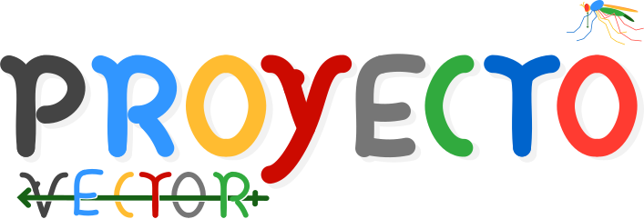

### Contenidos
[Revista Vector](#revista-vector)  ||  [Podcasts](#podcasts)  ||  [Nosotros](#nosotros)

---

# Revista PROYECTO VECTOR

## La revista de divulgación científica y tecnológica Argentina.

Volumen 1

Números:
###### 
#### (Para leer y descargar tocá la portada o entrá por [acá](https://bit.ly/3mCT37n-ProyectoVectorN1V1).)

###### 
#### (Para leer y descargar tocá la portada o entrá por [acá](https://drive.google.com/file/d/178XMdk2d7tHr6CqSkPTQG8mjRPsw1T8O/view?usp=sharing).)

¡Al fin salió!

##### Volver al inicio: [Contenidos](#contenidos)
---

# Podcasts

## Charlas, debates y entrevistas de ciencia y tecnología.

¡Más contenido próximamente!

##### Volver al inicio: [Contenidos](#contenidos)
---
# Nosotros
## La iniciativa y el equipo

PROYECTO VECTOR es una iniciativa didáctica con el fin de dinamizar el intercambio entre la investigación científica y el resto de sociedad. Queremos comunicar el desarrollo científico y tecnológico del país de forma rigurosa y comprensible. Nos interesa presentar a los protagonistas de la ciencia, en especial a los tesistas de doctorado, investigadores postdoctorales e investigadores jóvenes del país.  

Somos un equipo comprometido y motivado. Nos esforzamos para ser referentes en comunicación científica argentina y queremos llegar a la sociedad completa. Para lograrlo, necesitmaos lograr la difusión federal de nuestros contenidos. Podés ayudarnos a cumplir nuestro objetivo compartiendo nuestro trabajo. 

Muchas gracias.

## Los creadores de PROYECTO VECTOR

---
### La revista PROYECTO VECTOR es de libre acceso y gratuita.
##### Lista para disfrutar. Atte.: Equipo Proyecto Vector

---
---
Volver al inicio: [Contenidos](#contenidos)
